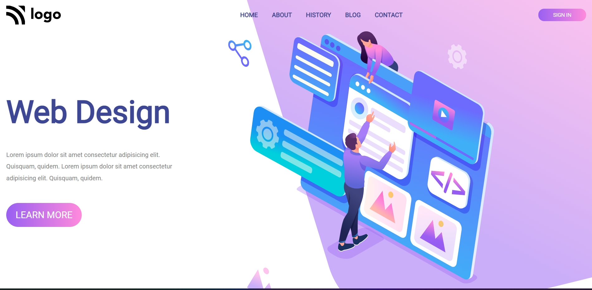

# Project-8

This project is a basic UI webpage which is created by using HTML and CSS. It's responsive.

## Authors

 >Manish Kumar

## What I learnt while creating this project

- Learnt about Media Queries
- Got to know about resizing the image
- Learnt CSS Grid and Positioning

## Honest Time to Finish Project

3 hours

# Netlify Link

[Project - ](https://project-8-mk.netlify.app/)

# Thumbnail

